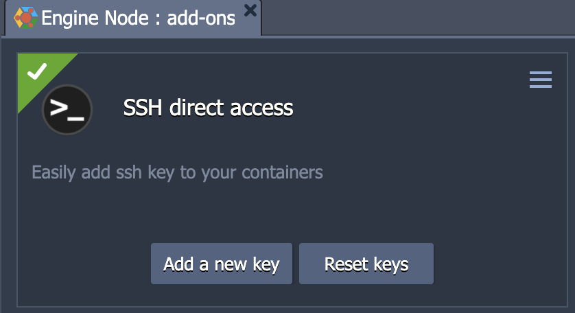

# SSH-direct-access-Add-on

To access your Jelastic container without going through the public gateway, simply copy and paste your public key in the field indicated above.
The installation will add a free IPv6 directly to the node and then show the appropiate command to use with an SSH Client.

### Post install

You can add new keys or delete added keys, by going to the add-on section of your container.

