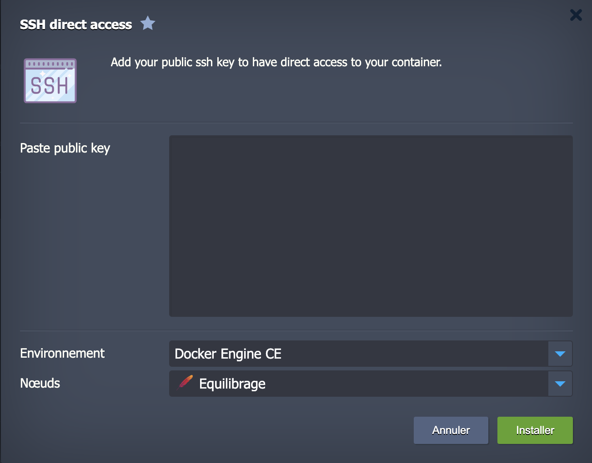

# SSH-direct-access-Add-on

To access your Jelastic container in direct access without going through the public gateway, simply copy / paste your public key in the field indicated above.
The installation will add a free ipv6 directly to the node indicated then will indicate the command to enter to access it.

### Post install

You can add new key or delete added keys by going to the add-on section of your container.

